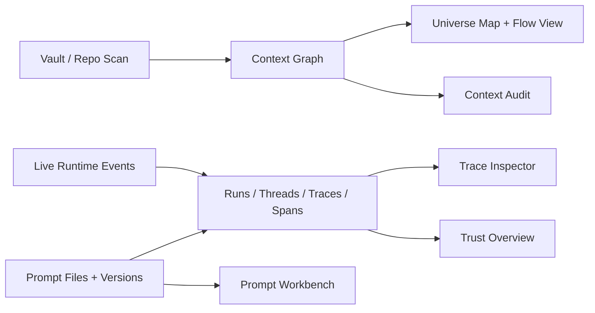

# Kosmos

[](https://github.com/chasefort/kosmosaos/actions/workflows/ci.yml)
[](https://www.npmjs.com/package/kosmos-aos)
[](/LICENSE)
[](https://www.getkosmos.xyz)

**Kosmos is a local-first observability and debugging workspace for AI agents.**

It gives developers a unified place to see an AI system's architecture, inspect runtime traces, iterate on prompts, monitor live activity, and audit whether local context can be trusted. Kosmos runs beside your repo, vault, prompts, and agent tooling without requiring a hosted dashboard or account.

The core question Kosmos answers is simple:

> Can I trust what my AI just did to this workspace?


## Quick Start

```bash
npx kosmos-aos
```

No install. No signup. No cloud. Kosmos opens locally in your browser at `http://localhost:5588`.

```bash
npx kosmos-aos ./path/to/your/project
npx kosmos-aos ~/Obsidian/MyVault
npx kosmos-aos ./examples/ai-context-vault
npx kosmos-aos --port 8080
npx kosmos-aos ./project --no-open
```

**Requires Node.js 18+**

- Website: [www.getkosmos.xyz](https://www.getkosmos.xyz)
- npm: [kosmos-aos](https://www.npmjs.com/package/kosmos-aos)
- Docs hub: [docs/README.md](docs/README.md)
- Screenshot tour: [docs/screenshots.md](docs/screenshots.md)
- Wiki source: [wiki/Home.md](wiki/Home.md)
- Issues: [github.com/chasefort/kosmosaos/issues](https://github.com/chasefort/kosmosaos/issues)
- Releases: [github.com/chasefort/kosmosaos/releases](https://github.com/chasefort/kosmosaos/releases)

## Product Tour

### Trust Overview


### Universe Map


### Live Monitoring


### Trace Inspector


### Context Audit


### Prompt Workbench


### Health Analysis


### Settings


### Integrations


### CLI Launch


### Open-Source Release Surface


More visuals and captions live in [docs/screenshots.md](docs/screenshots.md).

## Why People Use Kosmos

- **See the system, not just logs**. Map agents, tools, prompts, models, APIs, files, modules, memory stores, and runtime edges in one workspace.
- **Watch agent activity live**. Follow local AI tools as they read files, write files, call tools, and move through your context.
- **Replay with evidence**. Trace a session back to the exact spans, prompts, tool calls, touched files, costs, and context evidence that produced it.
- **Catch trust gaps before they spread**. Surface broken wikilinks, missing sources, orphan pages, unsupported outputs, stale generated files, and risky instruction files.
- **Iterate on prompts with behavior attached**. Keep prompt versions tied to actual traces instead of treating prompt edits like disconnected text changes.
- **Stay local-first**. Runtime data is stored locally in SQLite at `~/.kosmos/kosmos.db`.

## What Kosmos Can Do

- **Trust Overview**: answer whether the workspace is healthy enough to trust right now.
- **First-run Context Audit**: immediately surface the highest-risk issues agents should not rely on yet.
- **Universe Map**: explore notes, sources, outputs, instructions, files, prompts, tools, models, and runtime relationships as a visual graph.
- **Flow View**: inspect structure in a clearer 2D layout when the constellation view is too dense.
- **AI Sessions and Replay**: inspect spans, tool calls, file touches, prompt versions, costs, feedback, and run playback.
- **Context Audit**: find broken wikilinks, missing sources, orphan context, unsupported outputs, stale generated files, and prompt hygiene issues.
- **Prompt Versioning**: save instruction versions, link them to traces, and compare candidate changes against real examples.
- **Live Monitoring**: connect Claude Code, OpenClaw, or custom local ingest clients through the same local workspace.
- **Quick Markdown Editing**: make small fixes to prompts, instructions, and notes without pretending Kosmos should replace your main editor.

## How It Fits Together



Kosmos is designed so the static structure of your context and the live behavior of your AI tools reinforce each other. The graph shows what exists. The traces show what happened. The audit layer shows what is missing, unsupported, stale, or risky.

## Install And Run

Use the packaged CLI for the normal user-facing experience:

```bash
npx kosmos-aos ./your-project
```

Use the development server when you are working on Kosmos itself:

```bash
npm install
npm run dev
```

Build the npx/browser distribution:

```bash
npm run build:npx
```

Run the packaged server locally after a build:

```bash
node dist/server/index.js ./your-project
```

## Open Source And Safety

Kosmos is intended to be accessible as an open-source project and as the `kosmos-aos` npm package. The source repo includes the app, CLI/server mode, docs, wiki source, examples, tests, and release automation.

Before release, run:

```bash
npm test
npm run typecheck
npm run build:npx
npm run npm:check
```

The npm package uses a narrow `files` allowlist so publishable artifacts stay focused on the runtime distribution:

- `dist/server/`
- `dist/main/`
- `dist/shared/`
- `out/browser/`
- `out/main/index.js`
- `README.md`
- `LICENSE`
- `package.json`

## Documentation

Start with the docs hub in [docs/README.md](docs/README.md). The most useful entry points are:

- [Getting Started](docs/getting-started.md)
- [CLI And Install Guide](docs/cli-and-install.md)
- [Architecture Guide](docs/architecture.md)
- [Live Monitoring Guide](docs/live-monitoring.md)
- [Trace Inspector Guide](docs/trace-inspector.md)
- [Prompt Versioning Guide](docs/prompt-versioning.md)
- [Integrations Guide](docs/integrations.md)
- [Troubleshooting](docs/troubleshooting.md)
- [FAQ](docs/faq.md)
- [Product Positioning](docs/product-positioning.md)
- [Releasing And Publishing](docs/releasing.md)

If you want wiki-style pages for GitHub navigation, start with [wiki/Home.md](wiki/Home.md).

## Local-First By Default

- runtime data is stored locally in SQLite
- the primary database lives under `~/.kosmos/kosmos.db`
- the ingest endpoint defaults to `http://localhost:41414/ingest`
- the browser UI defaults to `http://localhost:5588`
- no account or hosted dashboard is required

## Validation

### Automated checks

```bash
npm test
npm run typecheck
npm run build
npm run build:npx
npm run website:build
```

### Manual validation

1. Start Kosmos with `npx kosmos-aos ./your-project` or `npm run dev`.
2. Open an Obsidian-style vault, Markdown knowledge base, or repo with prompts and agent code.
3. Run one task that reads a file, writes a file, and completes.
4. Confirm that the run appears in `AI Sessions`, the trace inspector shows spans and touched files, the trust overview refreshes after live activity, the context map highlights relevant graph nodes, and prompt versions stay linked when you edit and save an instruction file.

## Project Surfaces

- [CONTRIBUTING.md](CONTRIBUTING.md): contribution expectations, validation, and screenshot guidance
- [CODE_OF_CONDUCT.md](CODE_OF_CONDUCT.md): community behavior standards
- [SECURITY.md](SECURITY.md): private vulnerability reporting guidance
- [.github/ISSUE_TEMPLATE](.github/ISSUE_TEMPLATE): issue templates for bugs, features, and docs

## Roadmap

- first-class Obsidian vault detection, badges, and companion-plugin workflow
- clearer "what did AI read, change, cite, miss, or break?" session review
- stronger provenance checks for generated outputs
- broader runtime compatibility and smoother custom ingest setup
- richer WebGPU constellation renderer with graceful classic graph fallback

## License

Kosmos is released under the [MIT License](LICENSE).
