# Screenshots And Product Tour

These visuals are the fastest way to understand what Kosmos makes visible: structure, live behavior, prompt changes, trace evidence, and local trust gaps. Product screens are captured from a local Kosmos run against `examples/ai-context-vault`.

## Architecture Map

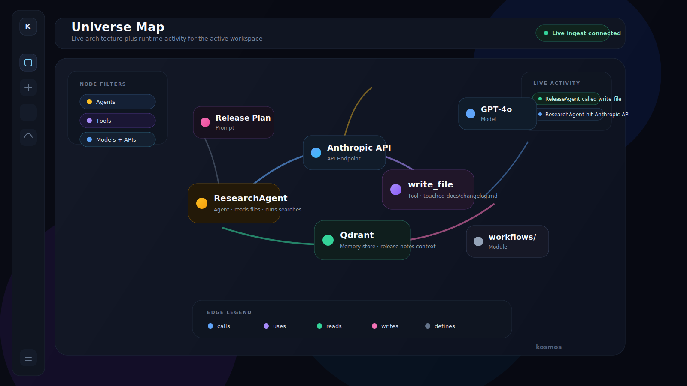

Use this view when you want to explain the whole system: agents, tools, prompts, models, APIs, modules, files, and the runtime relationships between them.

## Trust Overview

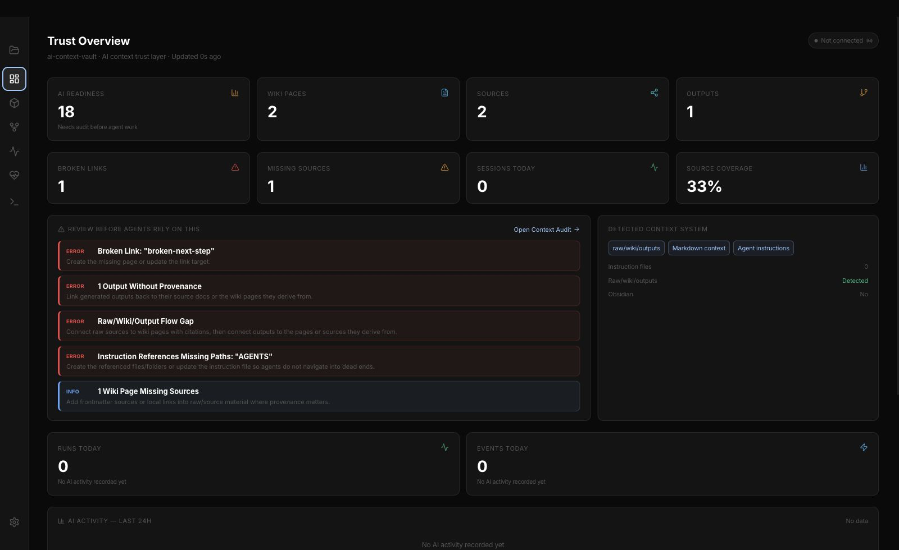

The dashboard gives you a fast read on scale, recent activity, local context health, usage, and where to drill in next.

## Universe Map

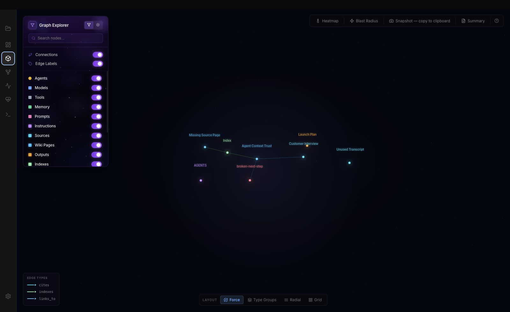

The Universe Map is the primary visual debugging surface. It keeps the graph expressive without losing labels, edges, filters, and inspection affordances.

## Live Monitoring

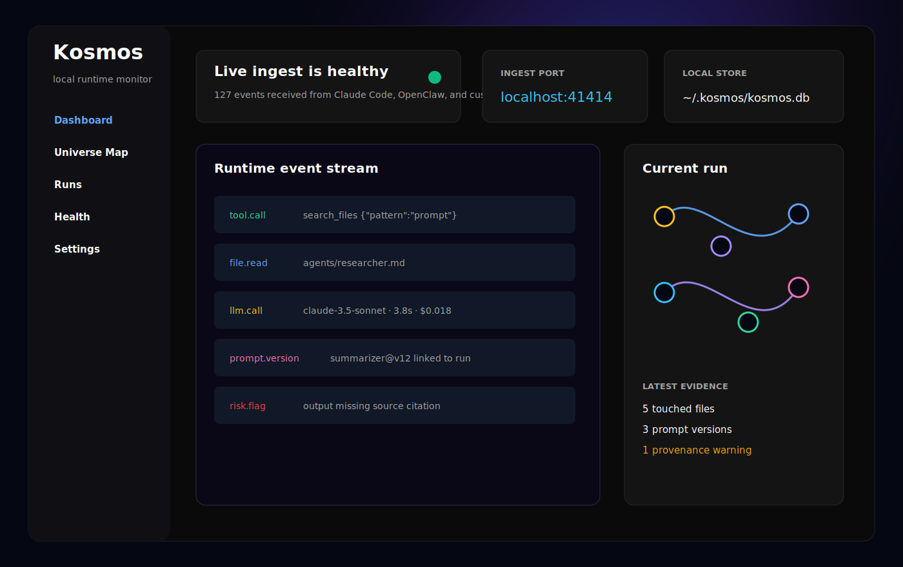

Live monitoring shows local runtime events as they arrive through the ingest endpoint. This is where file reads, tool calls, prompt versions, model calls, and risk flags become observable instead of disappearing into logs.

## Trace Inspector

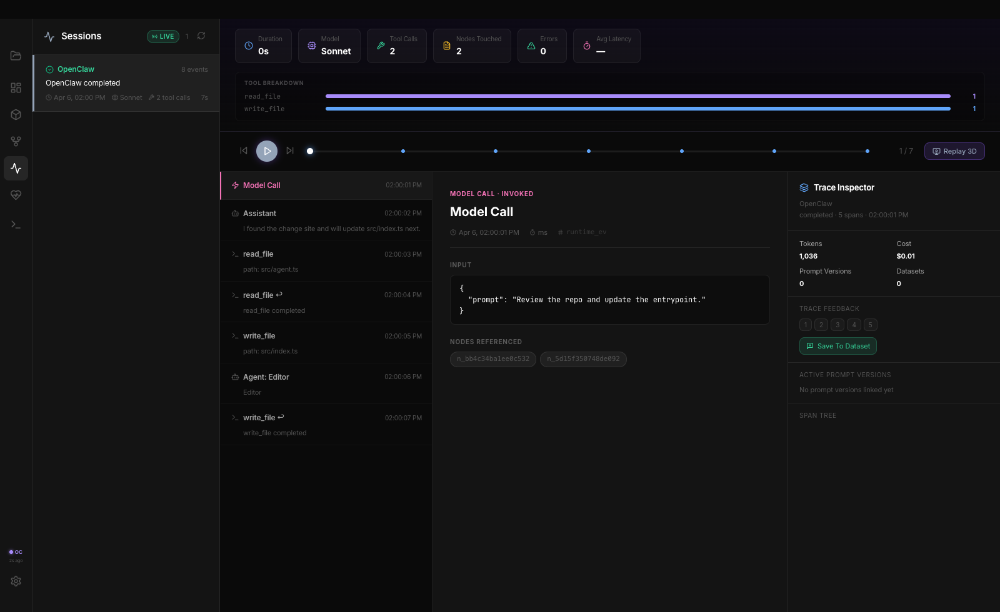

The trace inspector is the main behavioral debugging surface. Cost, spans, prompt versions, files, and tool calls line up in one place.

## Context Audit

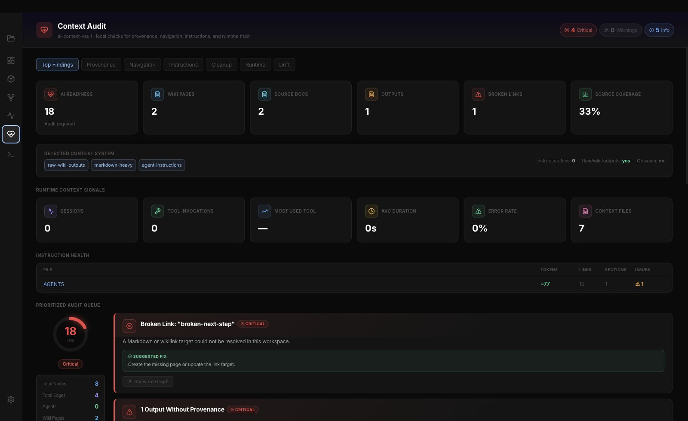

Context audit finds the local knowledge gaps an AI agent should not trust yet: broken wikilinks, unsupported outputs, stale generated files, orphan pages, and risky instructions.

## Prompt Workbench

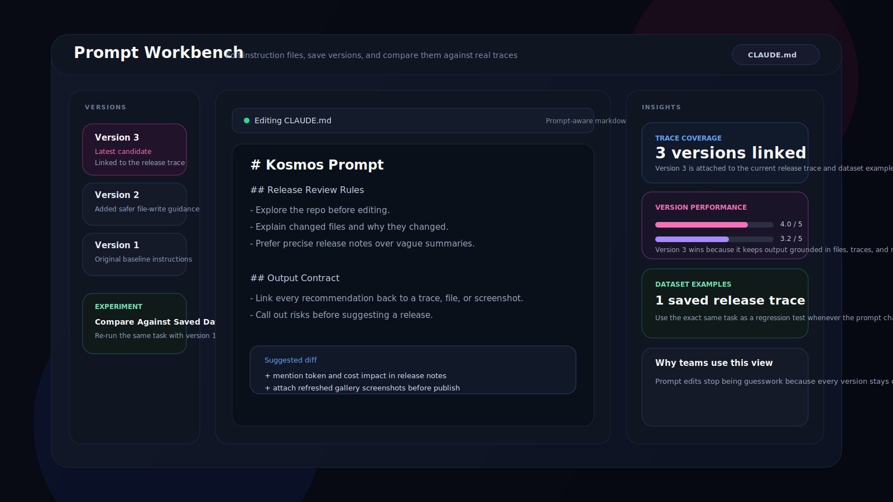

Prompt changes should stay connected to behavior. The workbench keeps saved versions, experiments, and trace-linked evidence close together.

## Health Analysis

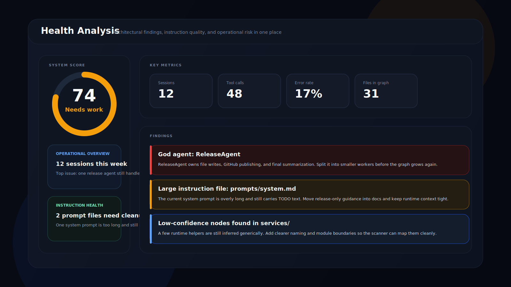

Health analysis surfaces overloaded agents, stale instructions, dependency risk, architecture findings, and prompt hygiene issues before they become release pain.

## Integrations

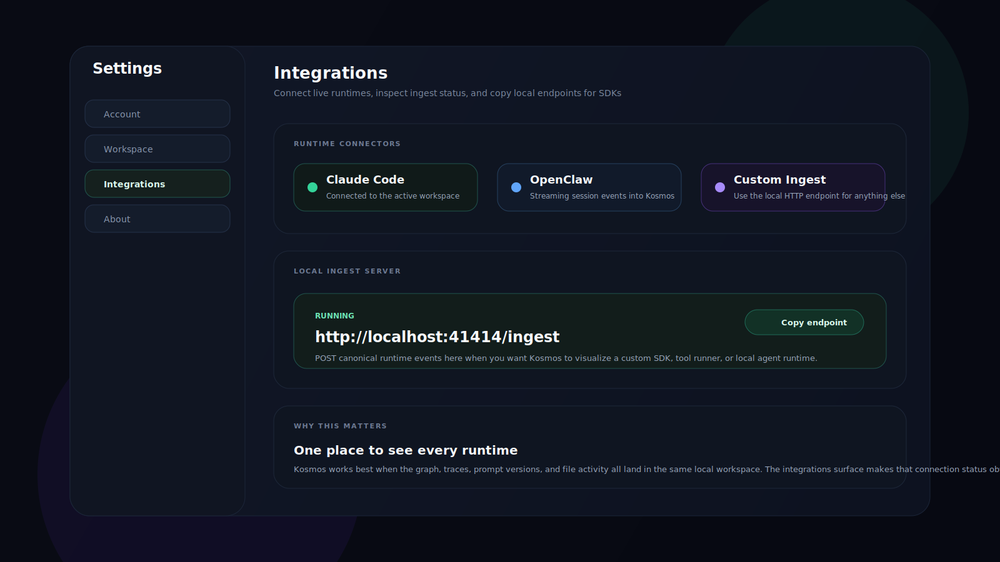

Kosmos works best when the graph and the runtime meet in the same local workspace. The integrations surface makes connection status and ingest setup explicit.

## Settings

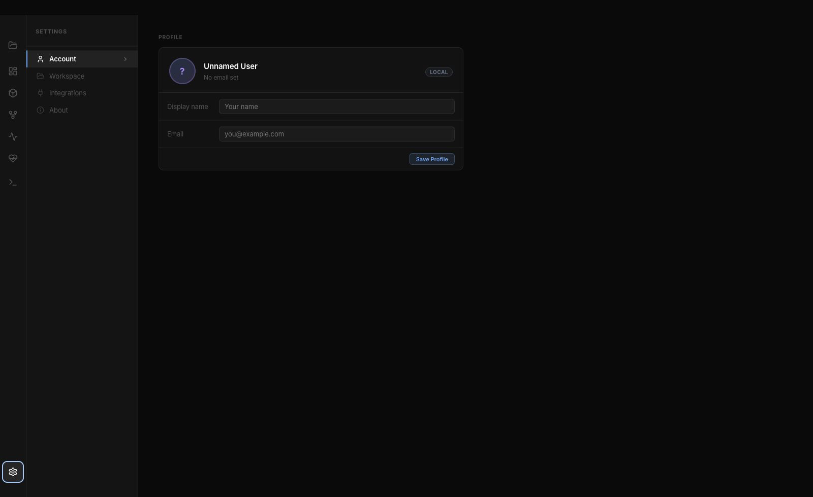

Settings keeps local workspace controls, integrations, and app links available without sending data to a hosted account surface.

## Sessions

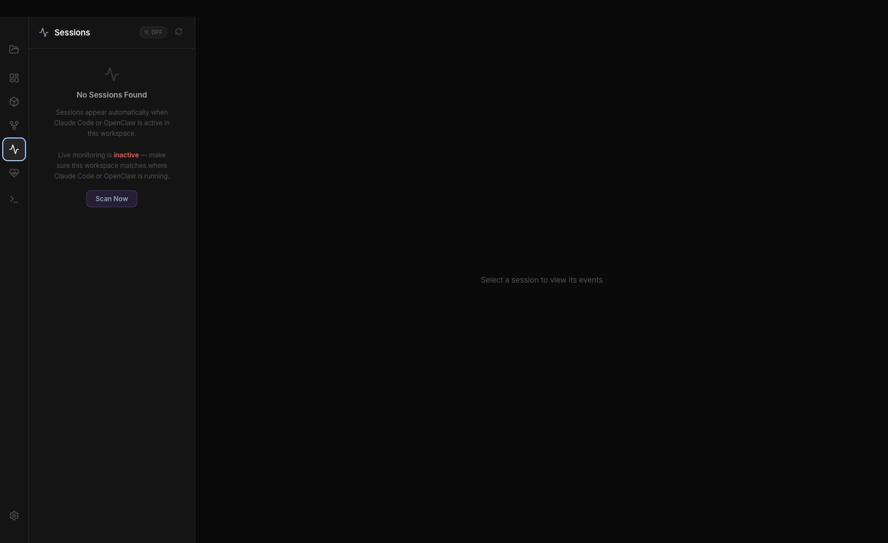

Sessions fill in as live agent events arrive. Empty states stay explicit so the user can distinguish "no runs yet" from a broken trace view.

## CLI Launch

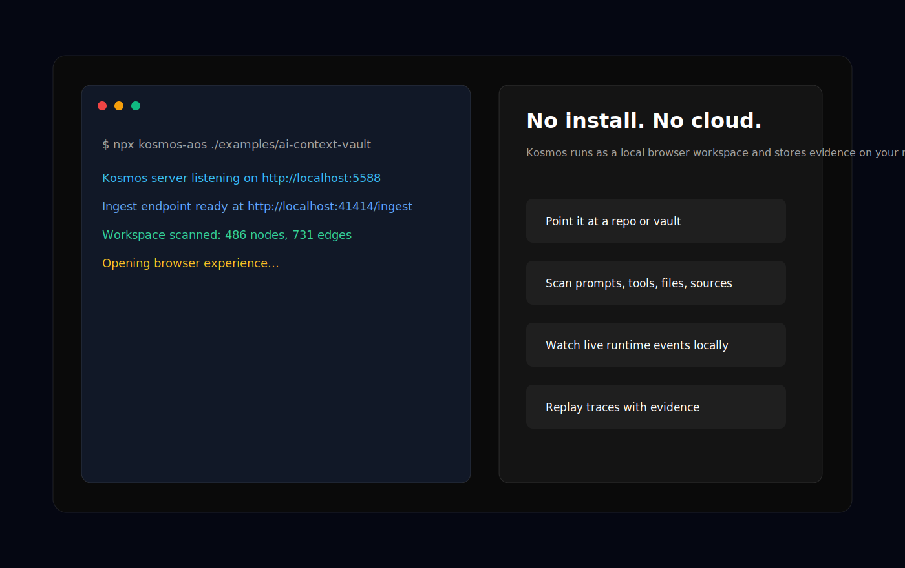

The fastest path is still `npx kosmos-aos`: point the CLI at a repo or vault and open the local browser workspace.

## Open-Source Release Surface

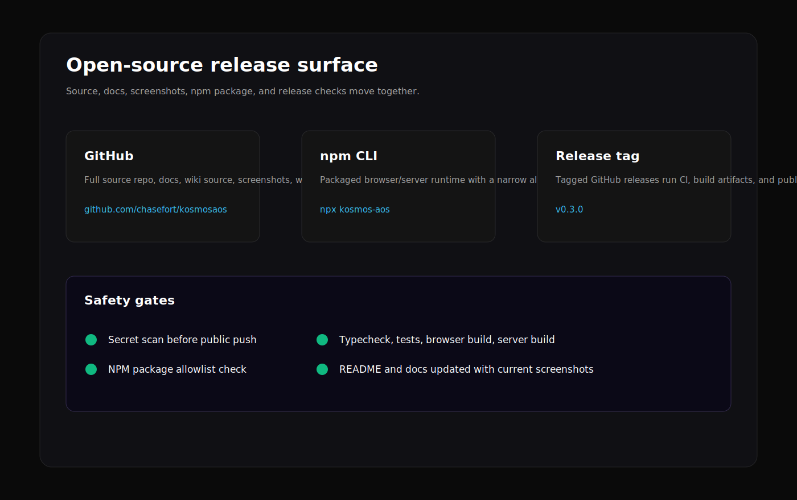

The public release surface should stay coherent: source repo, docs, screenshots, npm package, CI, release tags, and safety checks move together.
